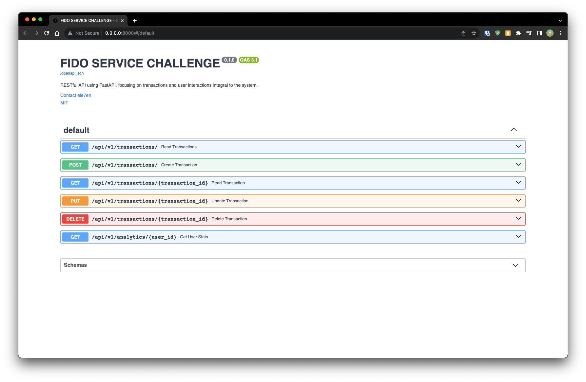

# FIDO BACKEND CHALLENGE

[](https://github.com/horlali/fido-challenge/actions/workflows/testing.yml)

RESTful API using FastAPI, focusing on transactions and user interactions integral to Fido's services.

## Getting Started

Clone repository to your local and navigate into the folder

```bash
git clone https://github.com/horlali/fido-challenge
cd fido-challenge/
```

Create the environment file and fill out the variables

```bash
cp .env.example .env
```

Build and start the application with docker-compose

```bash
./script/run-docker.sh
```

You can also add the `-d` flag to run the docker container as a daemon

```bash
./scripts/run-docker.sh -d
```

## Known issues

- Due to the disparity in how windows and linux handle line ending you might run into a line ending error which cause the container to fail on start up. See likely error below.

```bash
fido-challenge | exec ./scripts/run-server.sh: no such file or directory
```

To fix the error run the following command in the project root.

```bash
sed -i -e 's/\r$//' scripts/*
```

This should fix the issues. Rerun `./script/run-docker.sh` to start the application

## Dev Toolchain

| Tool                                              | Description               |
| :------------------------------------------------ | :------------------------ |
| [Docker](https://www.docker.com/)                 | containerization          |
| [Python ^3.11](https://www.python.org/)           | main programming language |
| [Poetry](https://python-poetry.org/)              | dependency management     |
| [Pytest](https://docs.pytest.org/)                | unit testing              |
| [Coverage](https://coverage.readthedocs.io/)      | coverage report           |
| [Black](https://github.com/psf/black)             | code formatting           |
| [Isort](https://pycqa.github.io/isort/)           | import sorting            |
| [Flake8](https://flake8.pycqa.org/en/latest/)     | style guide               |

## Setup Local Environment

```bash
poetry install
poetry shell
```

## Running tests

In the root of the repository `:~/fido-challenge` run the scripts below

```bash
./scripts/run-tests.sh
```

## Running linters

The `run-linters.sh` file in the `scripts/` folder tcan be used to check and correct formatting, styling and linting problems. It only checks for problems by default, if you would like to correct the errors you need to pass the `--fix` option. If you are using `zsh` and got some errors, consider execution via `bash`

In the root of the repository `:~/fido-challenge` run the scripts below

```bash
./scripts/run-linters.sh # add --fix flag to fix formatting/linting issues
```

## Sample Request and Application Docs

Once the application is up and running, visit <http://127.0.0.1:8000/> or <http://localhost:8000> or in your browser

You should see a Swagger Documentation Page like this


